<div align="center">

</div>

<div align="center">


</div>


<table>
<tr>
<td width="60%" valign="top">

### 👋 About Me

I'm a **Full Stack Developer** with **2.5+ years of production experience** shipping React & Next.js apps, headless CMS builds, Shopify storefronts, and **Telegram Mini Apps with TON Wallet integration**. Currently at **Most Lab**, previously delivered client work across **Denmark & Europe**.

```yaml
name: Md Abdullah
role: Full Stack Developer (MERN)
based_in: Dhaka, Bangladesh
education: B.Sc CSE — University of South Asia
currently_building: Telegram Mini Apps + TON Wallet products
award: Web Development Asset, Skill Competition 2023
```

</td>
<td width="40%" valign="top">

### ⚡ Quick Facts

| | |
|---|---|
| 🏢 | Full Stack Dev @ **Most Lab** |
| 🌍 | Clients in Denmark & Europe |
| 🛒 | Multi-vendor eCommerce builder |
| 🤖 | Telegram SDK · TON Wallet |
| 🏆 | Skill Competition Award '23 |
| 📫 | mdabdullah.dev@gmail.com |

</td>
</tr>
</table>


### 💼 Experience Timeline

<table>
<tr>
<td width="18%"><b>2026 — Present</b></td>
<td width="82%">

**Full Stack Developer** · Most Lab <sub><i>Full-time</i></sub><br/>
Shipping production apps & Telegram Mini Apps with **Next.js 16 · TypeScript · Tailwind**, owning frontend architecture end‑to‑end. Integrating **Sanity CMS** (schema design, GROQ, live preview) and **TON Wallet**.

</td>
</tr>
<tr>
<td><b>2023 — 2025</b></td>
<td>

**Full Stack Developer** · I Tech Hut <sub><i>Freelance</i></sub><br/>
Delivered apps for clients in **Denmark & Europe** (bookt.dk, vestornet.com) using React, Next.js, Vue.js & Laravel. Cut page load time by **30%+** via code‑splitting & lazy loading. Extended a web platform to **React Native**.

</td>
</tr>
<tr>
<td><b>2024 — 2025</b></td>
<td>

**Frontend Developer** · Bit Encrypt It <sub><i>Freelance</i></sub><br/>
Built multi‑vendor eCommerce & blog platforms from scratch (readyhow.com, etoilebd.com) — full vendor dashboards, MongoDB data modeling, lazy‑loaded performance gains.

</td>
</tr>
</table>


### 🛠️ Tech Stack

<div align="center">

</div>

<div align="center">


</div>


### 📊 GitHub Analytics

<table>
<tr>
<td width="50%">

</td>
<td width="50%">

</td>
</tr>
</table>


<div align="center">

</div>

### 🐍 Contribution Snake
 
<picture>
  <source media="(prefers-color-scheme: dark)" srcset="https://raw.githubusercontent.com/Mdabdullah3/Mdabdullah3/output/github-contribution-grid-snake-dark.svg" />
  <source media="(prefers-color-scheme: light)" srcset="https://raw.githubusercontent.com/Mdabdullah3/Mdabdullah3/output/github-contribution-grid-snake.svg" />
  
</picture>


### 📌 Featured Work

<table>
<tr>
<td width="50%">

**[Ton-NFT-E-commerce-Tma-Apps](https://github.com/Mdabdullah3/Ton-NFT-E-commerce-Tma-Apps-)**
Telegram Mini App to buy NFTs inside Telegram
`TypeScript`

</td>
<td width="50%">

**[XandOS-Analytics-Dashboard](https://github.com/Mdabdullah3/XandOS-Analytics-Dashboard)**
Analytics dashboard
`TypeScript`

</td>
</tr>
<tr>
<td width="50%">

**[Babur-Hat](https://github.com/Mdabdullah3/Babur-Hat)**
Multi-vendor eCommerce website
`JavaScript`

</td>
<td width="50%">

**[Solana-Blinks](https://github.com/Mdabdullah3/Solana-Blinks)**
Solana blockchain integration
`TypeScript`

</td>
</tr>
<tr>
<td width="50%">

**[Lazorkit-Sdk](https://github.com/Mdabdullah3/Lazorkit-Sdk)**
SDK tooling
`TypeScript`

</td>
<td width="50%">

**[shopify-theme](https://github.com/Mdabdullah3/shopify-theme)**
Custom Shopify storefront theme
`Liquid`

</td>
</tr>
</table>


<div align="center">

### 🌐 Let's Connect

<a href="https://abdullahme.vercel.app/"></a>
<a href="https://www.linkedin.com/in/md-abdullah-848267218/"></a>
<a href="https://medium.com/@mdabdullah.dev"></a>
<a href="mailto:mdabdullah.dev@gmail.com"></a>
<a href="https://www.instagram.com/abi_abdullah4/"></a>
<a href="https://www.facebook.com/profile.php?id=100039216726900"></a>

</div>


